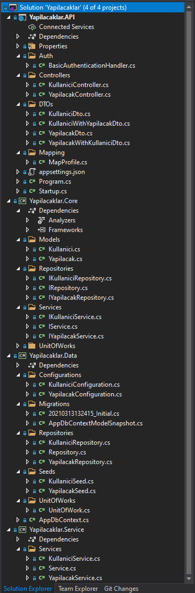
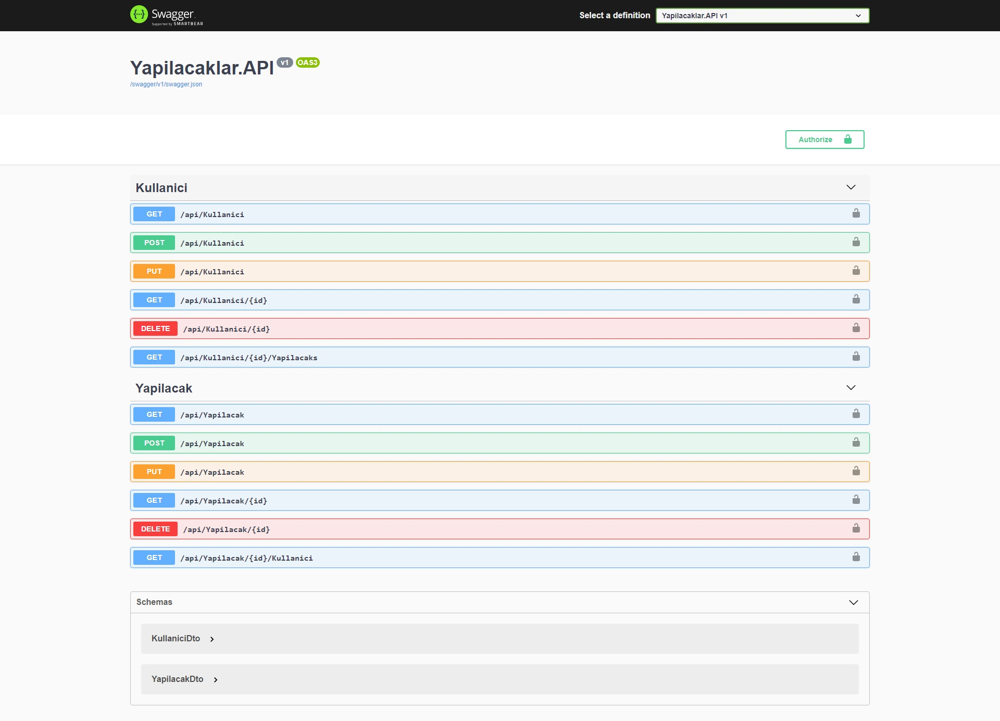
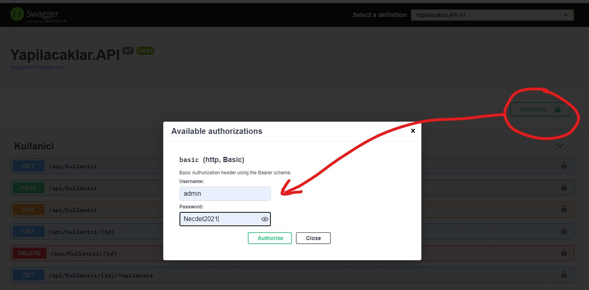
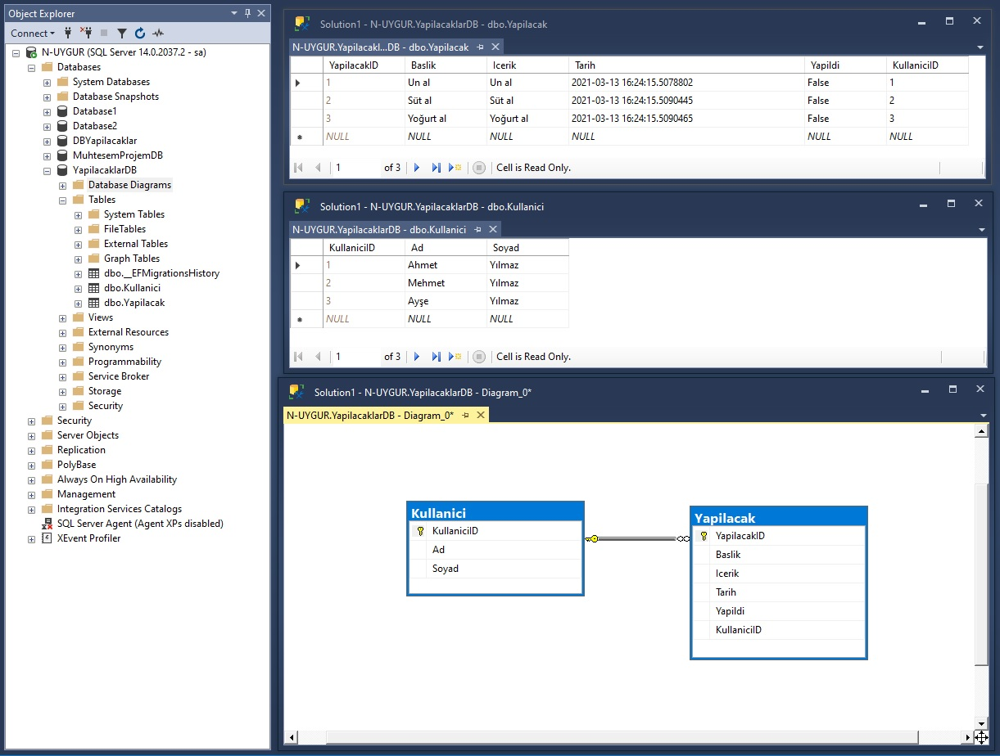

# ASP.NET Core Web API & MSSQL & Swagger

### Projeye Genel Bakış


### Proje başlatıldığında görünecek olan Swagger ekranı


### Swagger yetkilendirme ekranı


### Veritabanı bağlantı ve Swagger yetkilendirme kullanıcı adı şifre ayaları "appsettings.json" dosyasındadır
```
Connection String:
    ConnectionStrings.SqlConnectionString
    Default: Server=N-UYGUR;Database=YapilacaklarDB;User ID=sa;Password=Necdet2021;
Swagger Basic Authentication Username:
    BasicAuthentication.Username
    Default: admin
Swagger Basic Authentication Password:
    BasicAuthentication.Password
    Default: Necdet2021
```

### Veritabanı aşağıdaki görseldeki gibidir


### Migration'ları çalıştırma komutları aşağıdaki gibidir
```
Add-Migration Initial
Update-Database
```

<hr>

## Proje 4 katmandan oluşmaktadır
Bunlar sırasıyla
<br>1. Core
<br>2. Data
<br>3. Service
<br>4. API

gibidir.

### Core Katmanı
Model'lerin (Entity'lerin) ve Interface'lerin bulunduğu katmandır.
Bu katman hiç bir katmandan referans almaz. Tüm katmanlar bu katmanı referans alır.

### Data Katmanı
Migrations (veritabanındaki tabloları oluşturacak komutlar topluluğu),
Seed (veritabanındaki tabloların örnek kayıtlarının bulunduğu komutlar topluluğu),
Repository ve DBContext'lerin bulunduğu katmandır.
Bu katman Core katmanını referans alır, kullanır.

### Service Katmanı
Servisin, business code'un bulunduğu katmadır. API katmanı bu katman ile Data ve Core katmanlarına ulaşır.
Bu katman Core ve Data katmanlarını referans alır, kullanır.

### API Katmanı
Authentication (yetkilendirme), AppSettings (veritabanı bağlantı metni kullanıcı adı şifresi) ve Swagger (API kullanıcı diyalog arayüzü) bu katmandadır.
Bu katman tüm alt katmanları referans alır, kullanır.

<hr>

## Yapılacaklar.API Projesi içeriği
İki veriler topluluğundan oluştmaktadır.
<br>1. Kullanıcılar.
<br>2. Kullanıcılara bağlı, Yapılacaklar.

## Kullanıcılar'ın
- KullaniciID
- Ad
- Soyad

nitelikleri vardır.

## Yapılacaklar'ın
- YapilacakID
- Baslik
- Icerik
- Tarih
- Yapildi
- KullaniciID

nitelikleri vardır.
